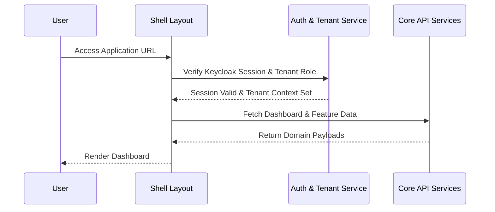

# Architecture Overview

SIF-Web is structured as a modern multi-tenant Angular application utilizing **Angular 21**, **Taiga UI** component library, and **Tailwind CSS**.

## Core Architectural Concepts

- **Modular Layout**: The application layout is orchestrated through `src/app/layout/shell/shell.ts` which integrates tenant context, branding, and navigation.
- **Component Design**: Recently migrated from PrimeNG to [Taiga UI](/openwiki/architecture/overview.md) for lightweight, accessible, and theme-adaptive UI primitives.
- **State and Context**: Managed via reactive services like `TenantContextService` and `AuthService` interacting with API clients under `src/app/core/api/services/`.

*Figure 2: Authentication, tenant context initialization, and data loading runtime flow.*

## Source Map & Key Directories

- `/src/app/core/`: Authentication guards, API service clients, interceptors, and global context providers.
- `/src/app/features/`: Feature modules including appointments, menus, patients, staff, settings, and tenant dashboards.
- `/src/app/layout/`: App shell, navigation headers, and layout wrappers.
- `/src/app/shared/`: Reusable UI primitives, chart configurations, and utility functions (e.g., BMI calculations, date formatters).

## Related Concepts
- Related to [Core Domains](/openwiki/domain/core-domains.md) for feature implementation details.
- Integrated with [API and Auth Integration](/openwiki/integrations/api-and-auth.md) for backend communication.
