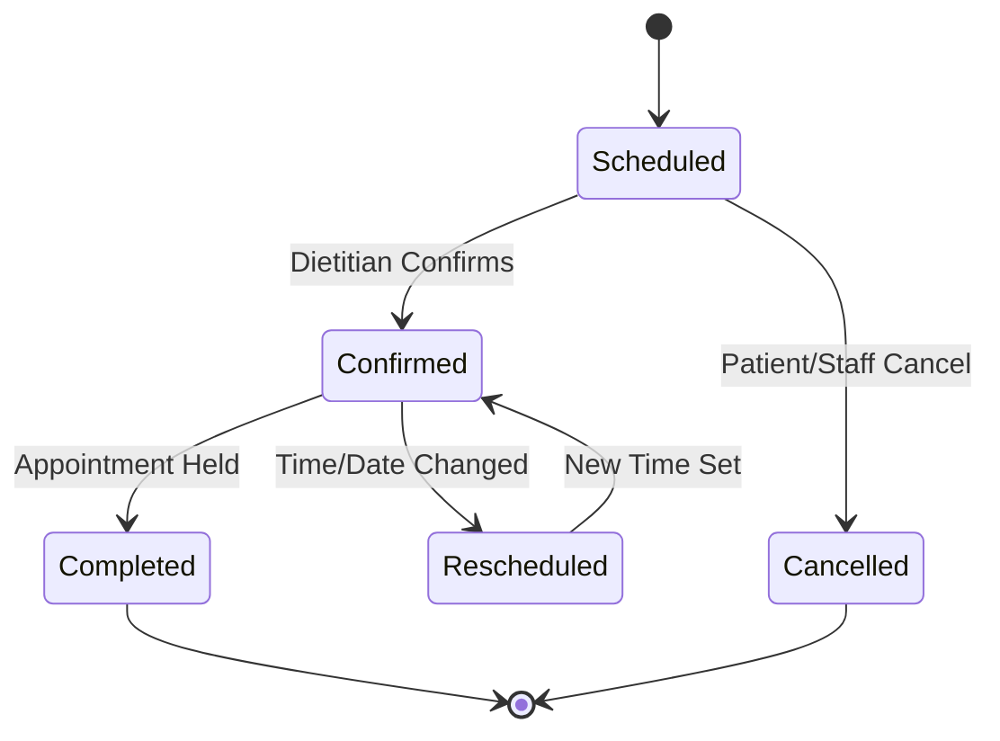

# Core Domains

SIF-Web manages nutritional clinics, dietitians, and patient interactions across multiple tenants.

## 1. Patients & Profiles
- **Patient Profile**: Captures demographics, physical attributes, body measurements (`BodyMeasurement`), and health event logs (`PatientEvent`).
- **BMI & Charts**: Integrates calculation utilities (`src/app/shared/utils/bmi.ts`) and Chart.js dashboards for tracking patient progress.

## 2. Nutritional Menus & Templates
- **Menu Management**: Dietitians design custom meal plans (`Menu`) structured into specific meals (breakfast, lunch, snack, dinner) via `MenuApi`.
- **Templates**: Reusable `MenuTemplate` assets allow rapid assignment of standard nutritional plans to patients.
- **PDF Export**: Supports exporting structured menus to PDF for patient convenience.

## 3. Appointment Scheduling
- **Calendar Integration**: Utilizes FullCalendar (`@fullcalendar/angular`) in `AppointmentsPage` (`src/app/features/appointments/appointments.page.ts`).
- **Appointment Types**: Configurable appointment categories and action dialogs manage scheduling, rescheduling, and status tracking.

## 4. Staff & Tenant Administration
- **Staff Management**: Role-based access control separates staff/dietitians from patient users via `UserTenantRoleApi`.
- **Branding & Settings**: Tenants can customize branding, logos, and anamnesis settings.

*Figure 3: Appointment lifecycle state machine.*

## Related Concepts
- Relies on [Architecture Overview](/openwiki/architecture/overview.md) for UI component primitives.
- Communicates through [API and Auth Integration](/openwiki/integrations/api-and-auth.md) endpoints.
