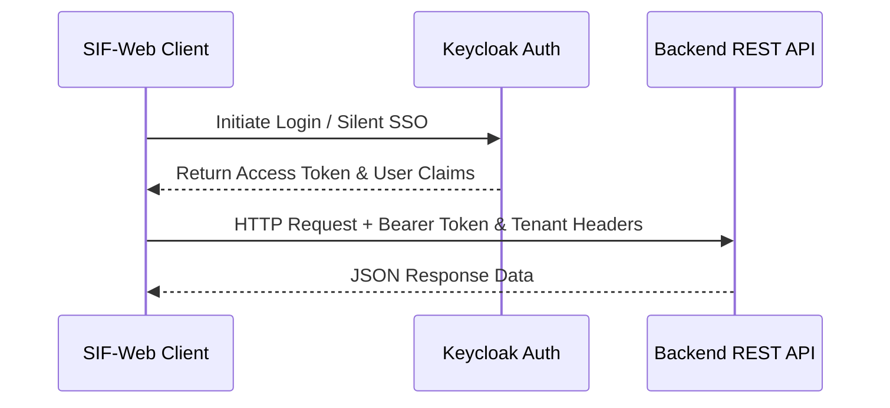

# API and Authentication Integration

SIF-Web connects to a backend API service and relies on Keycloak for identity management.

## Keycloak Authentication
- Configured via `src/app/core/auth/keycloak.config.ts` and `AuthService`.
- Guards such as `AuthGuard`, `AdminGuard`, and `PermissionGuard` secure protected routes based on user roles and permissions.

## API Services
- Located under `src/app/core/api/services/`.
- Key services include:
  - `MenuApi` & `MenuTemplateApi`: Managing nutritional plans.
  - `AppointmentApi` & `AppointmentTypeApi`: Scheduling operations.
  - `BodyMeasurementApi`: Patient tracking metrics.
  - `TenantApi` & `TenantBrandingApi`: Multi-tenant configuration and assets.

*Figure 4: Authentication handshake and API request flow.*

## Related Concepts
- Implemented within [Architecture Overview](/openwiki/architecture/overview.md).
- Powers [Core Domains](/openwiki/domain/core-domains.md) data operations.
