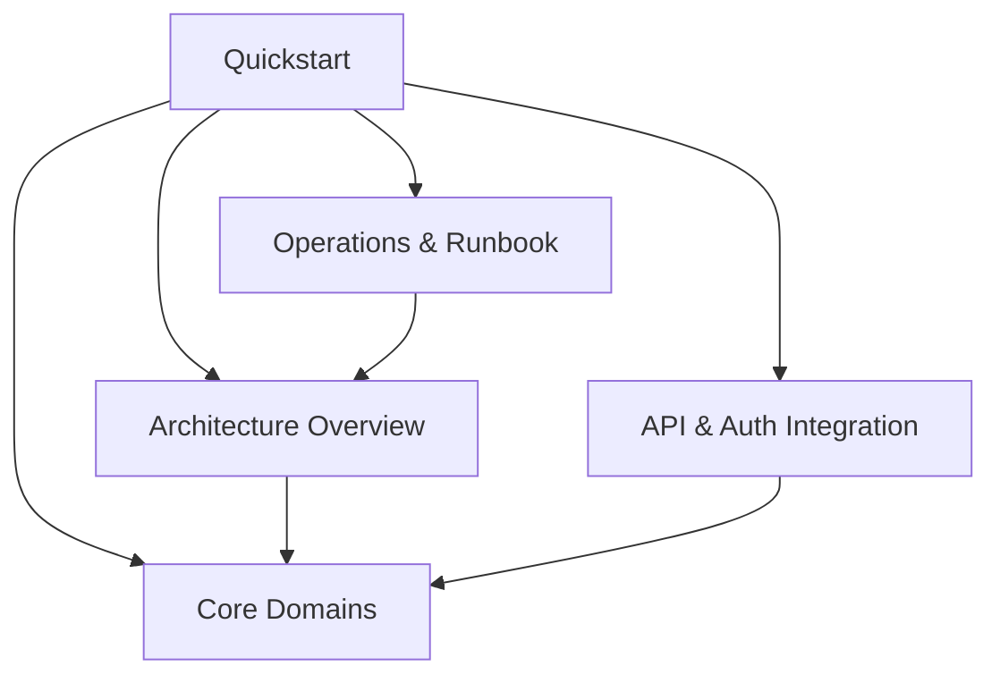

# OpenWiki Quickstart

Welcome to the **SIF-Web** technical documentation wiki. This knowledge base provides software architects, engineers, and maintainers with an architectural overview, domain breakdowns, operational guidelines, and integration references for the SIF-Web repository.

## Documentation Sections

- [Architecture Overview](/openwiki/architecture/overview.md): Explains the frontend modular architecture, Taiga UI adoption, state management, and routing.
- [Core Domains](/openwiki/domain/core-domains.md): Details the primary business domains including patients, nutritional menus, appointment scheduling, and staff/tenant management.
- [API and Authentication](/openwiki/integrations/api-and-auth.md): Outlines REST API services, Keycloak authentication integration, and multitenancy context.
- [Operations and Runbook](/openwiki/operations/runbook.md): Provides guides for building, serving, linting, testing, and troubleshooting the application.

## Quick Navigation & Core Relationships

*Figure 1: High-level navigation and documentation concept relationships.*

## Backlog

- **E2E Testing Suite**: Deferred comprehensive end-to-end testing setup due to active component migration phases.
- **Advanced Offline Caching**: Planned service worker enhancements for offline meal plan review.
